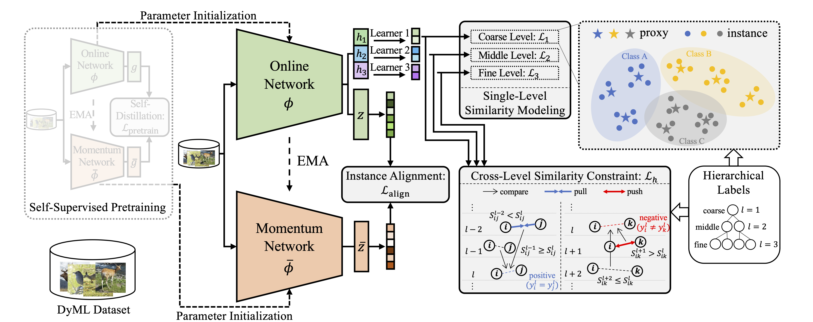
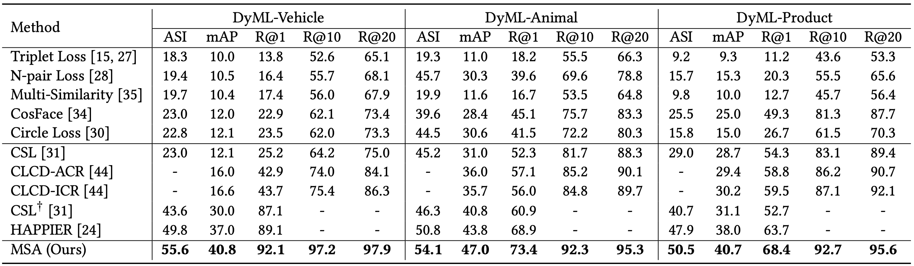

# MSA

This repository is the official implementation of [Multi-Scale Similarity Aggregation for Dynamic Metric Learning](https://dl.acm.org/doi/10.1145/3581783.3612547) on dynamic metric learning (DyML) task.

> 📋  Our code is based on [HAPPIER](https://github.com/elias-ramzi/HAPPIER) and we greatly appreciate for their work.

<div align=center></div>

## Requirements

This repo was tested with Ubuntu 20.04.1 LTS, Python 3.6, PyTorch 1.8.1, and CUDA 11.1 on one RTX 3090 GPU. 

## Training

1. Prepare the DyML datasets (DyML-Vehicle, DyML-Animal, DyML-Product).
   
   Download datasets from [here](https://github.com/SupetZYK/DynamicMetricLearning) and modify the ```data_dir``` in ```dyml_vehicle.yaml```, ```dyml_animal.yaml```, and ```dyml_product.yaml``` in ```MSA/happier/config/dataset/```.
   
   ```shell
   kwargs:
     data_dir: /path/to/dataset
   ```

2. Download pretrained models from [here](https://1drv.ms/f/s!AjPtGZ-NdOVRiXCcGzpjj3ixwxMg?e=oqhnlq) and put them into ```MSA/pretrained_model```.

3. To train the model(s) in the paper, run the following commands.
   
   DyML-Vehicle:
   
   ```shell
   sh run_vehicle_msa.sh
   ```
   
   DyML-Animal:
   
   ```shell
   sh run_animal_msa.sh
   ```
   
   DyML-Product:
   
   ```shell
   sh run_product_msa.sh
   ```

   > 📋  Note that for the DyML-Product dataset, learning a single embedding only for the fine level achieves a better R@1 result (~68%) than that of the complete version of MSA (~66%), and we report the former result. In ```run_product_msa.sh```, we provide the commands to train these two models.

## Testing

During testing, we evaluate the performance of both the online network and the momentum network, while the performance of the online network is reported. In TensorBoard, the tag ```Evaluation_EMA``` denotes the performance of the momentum network.

## Results

Our model achieves the following performance on three DyML datasets:

<div align=center></div>

## Citation

If you find this repo useful for your research, please consider citing this paper

```latex
@inproceedings{zhang2023msa,
    title = {Multi-Scale Similarity Aggregation for Dynamic Metric Learning},
    author = {Zhang, Dingyi and Li, Yingming and Zhang, Zhongfei},
    booktitle = {Proceedings of the 31st ACM International Conference on Multimedia},
    pages = {125–134},
    year = {2023},
    publisher = {Association for Computing Machinery},
}
```
